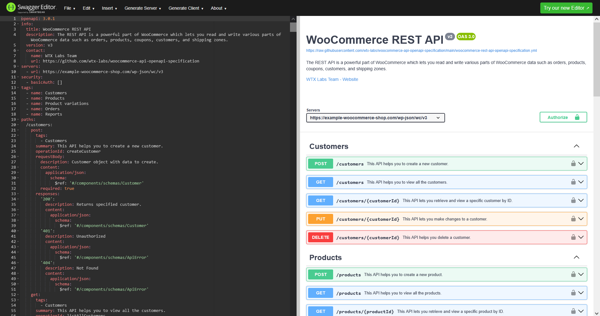

# WooCommerce REST API specification in OpenAPI 3.0 format
The WooCommerce REST API specification in OpenAPI 3.0 format.

---

> ⚠️ **Note: This is a development version!**
> 
> The specification is under development and will be gradually expanded to cover the key functionalities of the commerce engine.

---

### Quick glance at the API in Swagger
You can take a quick look at the API in Swagger [here](https://editor.swagger.io/?url=https://raw.githubusercontent.com/wtx-labs/woocommerce-api-openapi-specification/main/woocommerce-rest-api-openapi-specification.yml).

